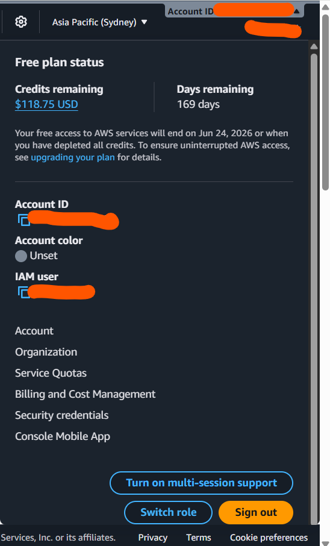

# AWS Cloud Operations Portfolio

This repository documents hands-on AWS infrastructure labs aligned with system engineering and MSP operational responsibilities.

The focus is on **security-first design**, **operational readiness**, **monitoring**, **backup**, and **cost governance**, reflecting real-world cloud support scenarios rather than certification-only examples.

---

## Objectives

- Secure AWS account and identity access
- Deploy isolated and controlled network environments
- Provision and troubleshoot compute resources
- Implement monitoring, alerting, and backups
- Enforce cost visibility and governance

---

## AWS Services Covered

- IAM
- VPC
- EC2
- CloudWatch
- SNS
- Cost Explorer
- AWS Budgets

## 1️⃣ IAM & Account Security Baseline

**Purpose:**  
Establish a secure AWS account foundation by protecting the root account and enforcing least-privilege access.

**Key Configurations:**
- Root MFA enabled
- Root access keys deleted
- IAM admin user created
- IAM read-only user created
- Password policy enforced
- IAM Access Analyzer enabled

**Screenshots:**
- IAM Account Overview

