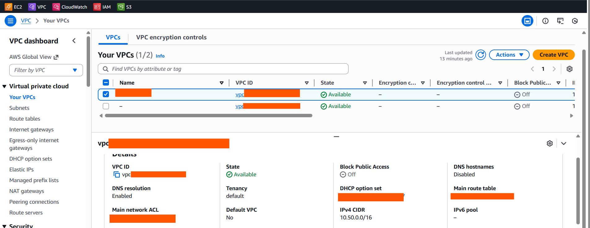
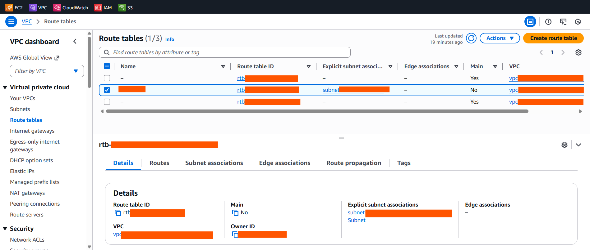
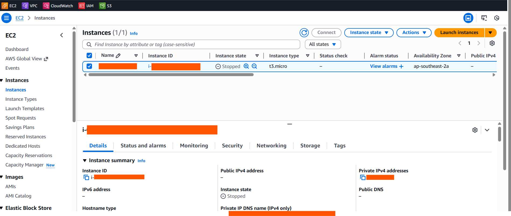
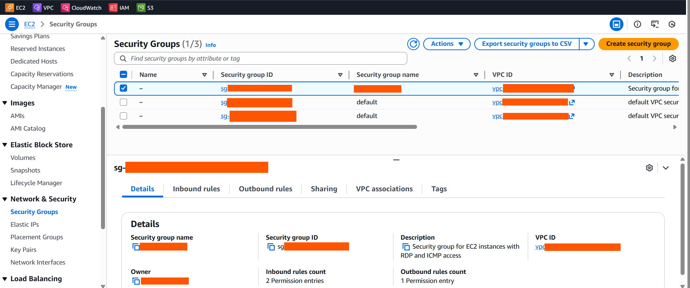
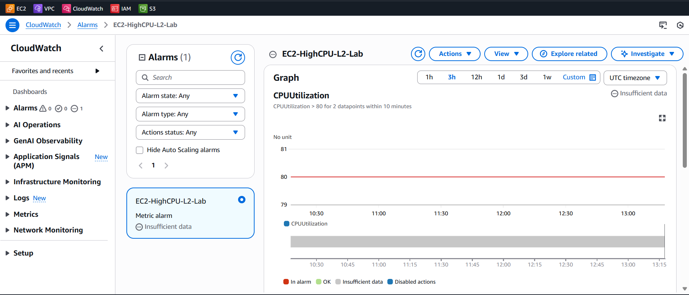

# AWS Cloud Operations Portfolio

This repository documents hands-on AWS infrastructure labs aligned with system engineering and MSP operational responsibilities.

The focus is on **security-first design**, **operational readiness**, **monitoring**, **backup**, and **cost governance**, reflecting real-world cloud support scenarios rather than certification-only examples.

---

## Objectives

- Secure AWS account and identity access
- Deploy isolated and controlled network environments
- Provision and troubleshoot compute resources
- Implement monitoring, alerting, and backups
- Enforce cost visibility and governance

---

## AWS Services Covered

- IAM
- VPC
- EC2
- CloudWatch
- SNS
- Cost Explorer
- AWS Budgets

## 1️⃣ IAM & Account Security Baseline

**Purpose:**  
Establish a secure AWS account foundation by protecting the root account and enforcing least-privilege access.

**Key Configurations:**
- Root MFA enabled
- Root access keys deleted
- IAM admin user created
- IAM read-only user created
- Password policy enforced
- IAM Access Analyzer enabled

**Screenshots:**

- IAM Account Overview

## 2️⃣ VPC Networking & Security

**Purpose:**  
Create a segmented and secure network environment to control traffic flow and minimize attack surface.

**Key Configurations:**
- Custom VPC created
- Public and private subnets configured
- Internet Gateway attached to public subnet
- Route tables configured
- Security groups restricting inbound access
- NAT Gateway intentionally avoided for cost control

**Screenshots:**
- VPC Overview

- Route Table Configuration
   
 

## 3️⃣ EC2 Windows Server Deployment

**Purpose:**  
Deploy and securely access a Windows Server EC2 instance while maintaining cost awareness.

**Key Configurations:**
- Windows Server EC2 instance launched
- Security group allowing RDP only from a restricted public IP
- RDP access validated
- Instance stopped when not in use to reduce costs

**Screenshots:**
- EC2 Instance State  
  

- Security Group Inbound Rules  
  

## 4️⃣ Monitoring & Alerting (CloudWatch)

**Purpose:**  
Provide operational visibility and proactive alerting for compute resources.

**Key Configurations:**
- CloudWatch metrics reviewed
- CPU utilization alarm created
- SNS email notification configured

**Screenshots:**
- CloudWatch Alarm  
  
